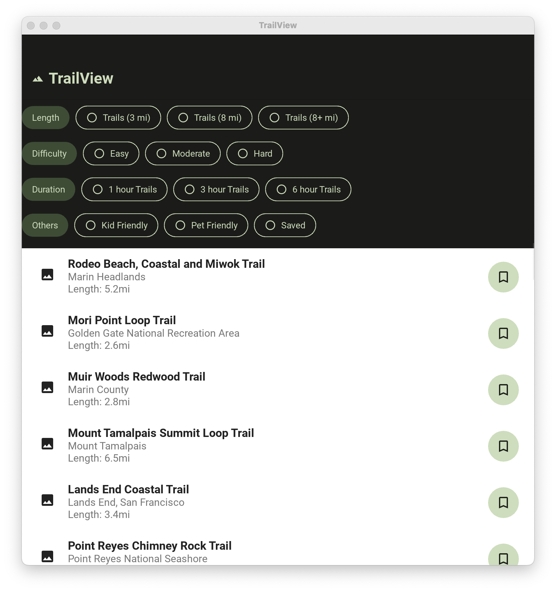

# TrailView App

TrailView is a mobile application built with KivyMD that allows users to explore and save hiking trails. The app provides features for filtering trails based on length, difficulty, duration, and pet/kid friendliness. Users can also mark trails as saved for future reference.



## Features

- Browse a list of hiking trails with detailed information.
- Filter trails based on length, difficulty, and duration.
- Toggle filters for pet-friendly, kid-friendly, and saved trails.
- Add new trails to the list with a name and location.
- Mark trails as saved for easy reference.

## Installation

Clone the repository:

```bash
git clone https://github.com/zhangxijing97/TrailView
cd TrailView
```

## Usage

- Launch the app to view a list of available trails.
- Use the filter buttons to customize the displayed trails.
- Click on a trail to see more details or mark it as saved.
- Add new trails by clicking on the "+" button and providing trail information.

## Contributing

Contributions are welcome! If you find any issues or have suggestions, please open an issue or create a pull request.

## License

This project is licensed under the MIT License.